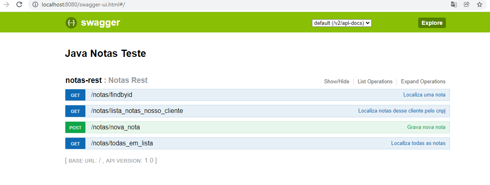
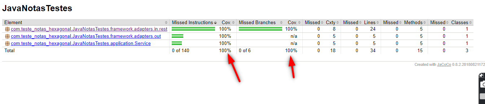

# NotasBackEndJavaHexagonal
Projeto criado para teste de uso de arquitetura hexagonal. 
Usando testes integrados e relatório de cobertura de testes.  
Banco MongoDB com objetos dentro de objetos.
  
-Requisitos: 
*Java11; 
*MongoDB; 
*Maven instalado e configurado;
  
-Swagger: http://localhost:8080/swagger-ui.html
 
  

 

Testes: 100% de cobertura alcançada
Atenção: Para os testes rodar precisa do mongoDB instalado. 
Os testes vão testar isso.
  

  
 
*Para rodar o relatório de cobertura acesse via dos como administrador da maquina  
a pasta do projeto.  
Então rode o comando mvn test e aguarde.  
Vai baixar dependencias e executar os testes e gerar o relatório.
 
Ele vai estar na pasta dentro de \target\site\jacoco\index.html

-Metodos disponiveis até o momento:  
 Lista tudo sem paginação.  
-[GET] http://localhost:8080/notas/todas_em_lista 
 
exemplo de curl:  
curl --location --request GET 'http://localhost:8080/notas/todas_em_lista' \
--header 'Authorization: MTIzNjU0Nzg5'
 

-[POST] http://localhost:8080/notas/nova_nota  
curl de Exemplo:    
curl --location --request POST 'http://localhost:8080/notas/nova_nota' \
--header 'Authorization: MTIzNjU0Nzg5' \
--header 'Content-Type: application/json' \
--data-raw '{
"tipoLancamento":"123",
"cnjpNossoCliente":"123",
"cnjpCliente":"123654897953",
"cnpjemissor":"123654897953",
"valorTotal":"999",
"valorTotalProdutos":"999",
"valorFaturar":"999",
"lancamentos":[
{
"idlancamento":"1",
"quantidade":"999",
"valorUnitario":"999",
"nomeItem":"999",
"cfop":"999",
"totalLancamento":"999"
},
{
"idlancamento":"2",
"quantidade":"999",
"valorUnitario":"999",
"nomeItem":"999",
"cfop":"999",
"totalLancamento":"999"
}
]
}'
  
-[GET] ListaPorNossoCNPJ/CNPJEMissor  
curl de Exemplo:  

curl --location --request GET 'http://localhost:8080/notas/lista_notas_nosso_cliente?cnpj=123' \
--header 'Authorization: MTIzNjU0Nzg5'
  
-[GET] Find por id  
curl de Exemplo:    
curl --location --request GET 'http://localhost:8080/notas/findbyid?id=613107884540935102969600' \
--header 'Authorization: MTIzNjU0Nzg5'